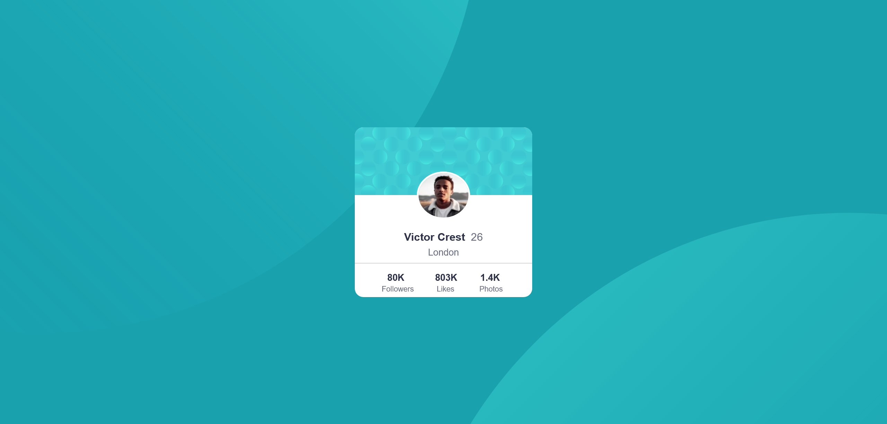

# Frontend Mentor - Profile card component solution

This is a solution to the [Profile card component challenge on Frontend Mentor](https://www.frontendmentor.io/challenges/profile-card-component-cfArpWshJ). Frontend Mentor challenges help you improve your coding skills by building realistic projects. 

## Table of contents

- [Overview](#overview)
  - [The challenge](#the-challenge)
  - [Screenshot](#screenshot)
  - [Links](#links)
- [My process](#my-process)
  - [Built with](#built-with)
  - [What I learned](#what-i-learned)
  - [Continued development](#continued-development)
  - [Useful resources](#useful-resources)
- [Author](#author)
- [Acknowledgments](#acknowledgments)

## Overview

### The challenge

- Build out the project to the designs provided

### Screenshot


 - Screenshot of the project

### Links

- Live Site URL: [Live Server URL](https://prasannapandhare.github.io/Profile-Card-Component.github.io/)

## My process

### Built with

- Semantic HTML5 markup
- CSS custom properties
- Flexbox

### What I learned

I have learned how to make simple templates using HTML and CSS with help of flex properties.

Observe below code for given project.

```html
<!DOCTYPE html>
<html lang="en">

<head>
    <meta charset="UTF-8">
    <meta name="viewport" content="width=device-width, initial-scale=1.0">
    <link rel="icon" type="image/png" sizes="32x32" href="./images/favicon-32x32.png">
    <title>Frontend Mentor | Profile card component</title>
    <link rel="stylesheet" href="style.css">
</head>

<body>

    <div id="wrapper">
        <div class="card">
            <div class="top">
                
            </div>
            <div class="mid">
                <h3>Victor Crest <span class="pad">26</span></h3>
                <span class="space">London</span>
            </div>
            <hr>
            <div class="last">
                <pre>
                    <span class="size">   80K            803K         1.4K</span>   
                    <span class="size2"> Followers           Likes            Photos</span>
                </pre>


            </div>
        </div>
    </div>

    <div class="attribution">
        Challenge by <a href="https://www.frontendmentor.io?ref=challenge" target="_blank">Frontend Mentor</a>.
        Coded by <a href="#">Prasanna Pandhare</a>.
    </div>
</body>

</html>
```
```css
@import url(https://fonts.google.com/specimen/Kumbh+Sans);

* {
    margin: 0;
    padding: 0;
    box-sizing: border-box;
    font-family: "Kumbh Sans", sans-serif;
}

#wrapper {
    font-family: "Kumbh Sans", sans-serif;
    height: 100vh;
    width: 100%;
    background-color: hsl(185, 75%, 39%);
    background-image: url(images/bg-pattern-top.svg), url(images/bg-pattern-bottom.svg);
    background-position: left top, right bottom;
    background-repeat: no-repeat, no-repeat;
    background-size: 100%, 100%;
    background-position-x: -700px, 700px;
    background-position-y: -130vh, 50vh;
    display: flex;
    justify-content: center;
    align-items: center;
}

.card {
    height: 40%;
    width: 20%;
    background-color: white;
    border-radius: 15px;
    overflow: hidden;
}

.top {
    height: 40%;
    background-image: url(images/bg-pattern-card.svg);
    background-size: 100%;
}

.top img {
    height: 70%;
    width: 30%;
    border-radius: 50%;
    margin-left: 35%;
    margin-top: 25%;
    border: 3px solid white;
}

.mid {
    display: flex;
    flex-direction: column;
    align-items: center;
    margin-top: 20%;
    color: hsl(229, 23%, 23%);
}

span {
    color: hsl(227, 10%, 46%);
}

.mid h3 {
    display: flex;
    gap: 10px;
}

.pad {
    font-weight: lighter
}

.space {
    margin-top: 2%;
    margin-bottom: 3%;
}

hr {
    height: 1px;
    border: none;
    /* background-color: hsl(227, 10%, 46%); */
    background-color: lightgray;
}

.last {
    margin-top: 5%;
    margin-left: -15%;
    display: flex;
    /* justify-content: space-around; */
    gap: 10px;
}

.size {
    color: hsl(229, 23%, 23%);
    font-weight: bolder;
}

.size2 {
    font-size: small;
}


.attribution {
    font-size: 11px;
    text-align: center;
}

.attribution a {
    color: hsl(228, 45%, 44%);
    text-decoration: none;
}
```

### Continued development

I am trying to improve my skills in media queries.

### Useful resources

- [MDN Docs](https://developer.mozilla.org/en-US/) - Helped me in various learnings. 

## Author

- Website - [Prasanna Pandhare](https://www.your-site.com)
- Frontend Mentor - [@Prasannapandhare](https://www.frontendmentor.io/profile/Prasannapandhare)

## Acknowledgments

I understood the importance of CSS in designing HTML structure.
As well as understood about responsive websites.
